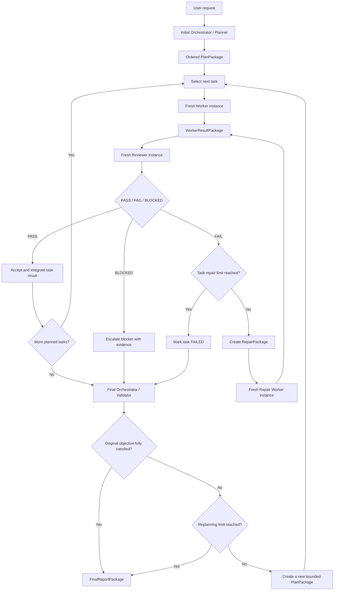

# Canonical Orchestration Workflow

> **Status:** Target design contract. This document defines the workflow that future refactors and implementation work must preserve. It does not claim that every behavior below is already implemented.
>
> **Last confirmed:** 2026-07-28

## Objective

A request received by one Hermes profile is transformed into a bounded, review-driven execution workflow:

1. an initial orchestrator analyzes the request and project;
2. it creates an ordered task plan and reviewer guidance;
3. one fresh worker instance executes each task;
4. one fresh reviewer instance evaluates each result;
5. failed reviews trigger bounded repair attempts;
6. after all accepted tasks are integrated, a final orchestrator validates the complete result against the original objective;
7. failed final validation triggers bounded replanning and another execution cycle;
8. the run ends with one evidence-backed report.

## Identity, inherited profile context, and model routing

The workflow is launched from a **single Hermes profile**: the profile that received the user's request.

All planner, worker, reviewer, repair, and final-validator roles are ephemeral Hermes `AIAgent` instances launched under that same profile. They are not separate durable Hermes profiles.

Because they are instances of the same Hermes profile, every role receives the profile's normal agent-level context and capabilities, including its SOUL, memory system and retrieval behavior, project-level instructions, configured skills and tools, and approval environment, subject to the normal Hermes runtime and profile configuration.

Profile inheritance is distinct from parent-session inheritance. A child does not need a blind copy of the complete parent conversation transcript or unrelated run history. The current objective, task-specific context, prior results, constraints, and evidence required for the role are passed through explicit structured packets. Any parent-session detail required for correctness must be included deliberately in those packets.

Role instructions supplied through `agentType` or the workflow packet augment and specialize the inherited profile identity. They must not silently erase or replace the profile's normal SOUL and memory unless an explicit, documented configuration requests that behavior.

Each role may use a separately configured model:

- `initial_orchestrator_model`
- `worker_model`
- `reviewer_model`
- `repair_worker_model`
- `final_orchestrator_model`

A role may inherit the launching session's model, use an `agentType` default, or receive an explicit model override. Provider-specific model names must never be hardcoded into orchestration logic.

## Canonical flow



## Planning contract

The Initial Orchestrator receives the original request, the inherited Hermes profile context, the relevant project context, constraints, allowed mutations, and available evidence.

It must produce a structured `PlanPackage` containing:

- original objective and normalized requirements;
- ordered tasks and dependencies;
- one scoped `TaskPackage` per task;
- acceptance criteria for every task;
- reviewer objectives and rejection conditions for every task;
- expected evidence;
- allowed files, paths, tools, and mutations;
- integration expectations;
- task timeout and retry limits;
- final validation criteria;
- assumptions, risks, and known blockers.

The planner must explicitly instruct the reviewer. A reviewer must never receive only the worker prompt and worker output and be asked whether the work "looks correct."

## Task execution contract

The default execution mode is **sequential by task order**. Each task gets one fresh logical worker instance. Independent tasks may be parallelized only when configuration explicitly permits it and write isolation or non-overlapping mutation scopes are proven.

A worker receives a `TaskPackage` containing at least:

```yaml
task_id: string
plan_id: string
cycle_id: integer
objective: string
context: object
constraints: [string]
allowed_paths: [string]
allowed_mutations: [string]
acceptance_criteria: [string]
evidence_requirements: [string]
dependencies: [string]
timeout_seconds: integer
attempt: integer
```

The worker returns a `WorkerResultPackage` containing at least:

```yaml
task_id: string
attempt: integer
status: COMPLETED | BLOCKED | FAILED
summary: string
changes: [object]
commands_or_tools_used: [object]
tests_or_checks: [object]
evidence: [object]
remaining_risks: [string]
blockers: [string]
```

Activity is not success. A worker result is only a claim until reviewed.

## Review contract

The reviewer receives a `ReviewRequestPackage` containing:

- the original `TaskPackage`;
- planner-authored review guidelines;
- required acceptance and rejection criteria;
- the complete `WorkerResultPackage`;
- relevant project state, diff, files, tests, logs, and evidence;
- prior review and repair history for this task, when applicable.

The reviewer returns a structured `ReviewVerdictPackage`:

```yaml
task_id: string
attempt: integer
verdict: PASS | FAIL | BLOCKED
criteria_results:
  - criterion: string
    result: PASS | FAIL | UNKNOWN
    evidence: [object]
findings: [string]
missing_items: [string]
repair_instructions: [string]
risks: [string]
confidence: low | medium | high
```

Rules:

- `PASS` requires evidence that all material acceptance criteria are satisfied.
- `FAIL` requires concrete findings and actionable repair instructions.
- `BLOCKED` requires a specific external dependency, permission, missing input, or unresolvable condition.
- The system must never force `PASS`, default to success, or silently discard a failed verdict.

## Repair contract

A failed review may launch a **fresh repair worker**, not merely continue the same worker session.

The repair worker receives a `RepairPackage` containing:

- the original `TaskPackage`;
- the previous `WorkerResultPackage`;
- the `ReviewVerdictPackage`;
- repair attempt number;
- focused correction instructions;
- unchanged acceptance criteria and evidence requirements.

Repair attempts are bounded by `max_task_repairs`. Each attempt must be materially informed by the prior failure. When the limit is reached, the task is marked `FAILED` and carried into final validation and reporting; it must not be disguised as accepted.

## Integration contract

Only results with a `PASS` verdict may be integrated as accepted task outcomes.

The workflow must preserve lineage between:

- request;
- planning cycle;
- task;
- worker attempt;
- review verdict;
- repair attempt;
- integrated result;
- final validation;
- final report.

Concurrent writes require isolated worktrees or proven non-overlapping mutation scopes. Integration conflicts are explicit failures, not silent last-write-wins behavior.

## Final validation and replanning

After the planned tasks finish, the Final Orchestrator receives:

- the original user request and normalized objective;
- every generated plan and planning-cycle history;
- all task packets, worker results, reviewer verdicts, repairs, and blockers;
- the integrated project state and relevant files;
- test, validation, telemetry, and evidence records;
- unresolved risks and failed tasks.

It validates the **integrated result against the original objective**, not merely whether every task produced output.

The final verdict is:

- `APPROVED`: the original objective is materially satisfied with evidence;
- `NOT_APPROVED`: requirements remain unmet and another bounded plan is possible;
- `BLOCKED`: completion depends on an external condition that the workflow cannot resolve.

On `NOT_APPROVED`, the Final Orchestrator creates a new `PlanPackage` focused only on missing, incorrect, or regressed requirements. The full plan-execute-review-repair cycle repeats up to `max_replanning_cycles`.

The system must not call synthesis or a polished summary "final verification." Final validation is an explicit evidence-based verdict over the integrated project.

## Final report

Every terminal run produces one `FinalReportPackage` containing:

- original request;
- final status: `APPROVED`, `NOT_APPROVED`, `BLOCKED`, `FAILED`, `STOPPED`, or `TIMED_OUT`;
- models and agent types used per role;
- planning cycles and ordered task history;
- worker attempts and reviewer verdicts;
- repairs performed and limits reached;
- integrated changes;
- tests, checks, and evidence;
- unresolved failures, blockers, and risks;
- token, duration, tool, and agent accounting when available;
- concise user-facing explanation of what happened and what remains.

## Required configuration

```yaml
initial_orchestrator_model: inherit
worker_model: inherit
reviewer_model: inherit
repair_worker_model: inherit
final_orchestrator_model: inherit

sequential_tasks: true
max_task_repairs: 2
max_replanning_cycles: 2
concurrency: 1
workflow_timeout_seconds: 900
child_timeout_seconds: 300
```

These are illustrative defaults, not hardcoded constants. Existing Hermes configuration, approvals, runtime controls, persistence, telemetry, transcripts, accounting, resume behavior, memory behavior, SOUL loading, and worktree support remain authoritative and must be reused.

Child roles must periodically decide whether available evidence is already sufficient to execute or submit. Configurable repeated-signature detection may warn and then stop equivalent observable read/search or invalid-submission loops, but it must remain a circuit breaker: it may not classify task complexity, replace model judgment, or turn a tool-call budget into a target.

## Non-negotiable invariants

1. One launching Hermes profile owns the complete run.
2. Every role is an ephemeral `AIAgent` instance launched under that profile, not another durable profile.
3. Every role inherits the launching profile's normal SOUL, memory system, project-level context, skills, tools, and approval environment.
4. Role-specific instructions augment the inherited profile identity instead of silently replacing it.
5. The complete parent conversation is not copied blindly; task-specific run context is transferred through structured, schema-validated packets.
6. Every role can use a different configurable model.
7. The planner provides both worker instructions and reviewer guidelines.
8. Every task receives an evidence-backed `PASS`, `FAIL`, or `BLOCKED` review.
9. Repairs and full replanning cycles are bounded and configurable.
10. Only accepted results are integrated.
11. Final validation checks the integrated project against the original request.
12. The user receives one honest, evidence-backed terminal report.
13. Existing Hermes approval governance is never bypassed.
14. Existing run state, journal, transcripts, notifications, dashboard, resume cache, and controls are extended rather than replaced.

## Refactor rule

Future refactors must compare proposed behavior against this document. Where current code differs from this contract, the difference must be identified explicitly as one of:

- missing implementation;
- deliberate temporary limitation;
- verified incompatibility with Hermes runtime;
- superseded contract decision.

No implementation may silently weaken these guarantees.
